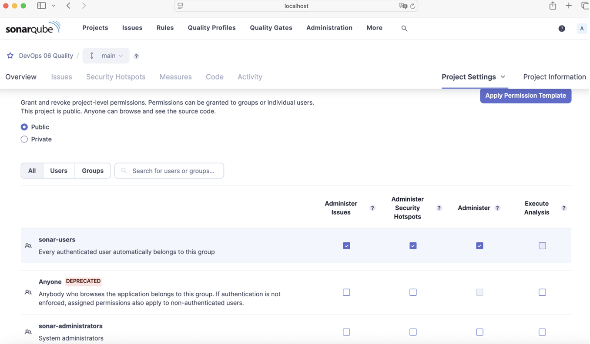

# DevOps 06 Quality

## Lernjournal

| Schritt | Beschreibung | Screenshot |
|--------|--------------|------------|
| 1 | Ein einfaches HTML-Dokument wurde in Visual Studio Code erstellt. Die Datei `index.html` enthält eine grundlegende Struktur mit `<title>` und einer Überschrift. |  |
| 2 | Die Erweiterung **HTMLHint** wurde im VS Code Marketplace gesucht und installiert, um die HTML-Datei auf Qualitätsprobleme zu überprüfen. |  |
| 3 | Die installierte Erweiterung **HTMLHint** zeigt nach dem Speichern direkt Warnungen zu fehlenden Standards (z. B. `<!DOCTYPE html>`) an. |  |
| 4 | Die HTML-Datei wurde entsprechend den Hinweisen angepasst. Es wurden die fehlenden Elemente ergänzt, bis keine Warnungen mehr angezeigt wurden. |  |
| 5 | Anschliessend habe ich das Repository mit GitHub synchronisiert. Dabei trat zunächst ein Push-Fehler auf, der durch einen vorherigen `git pull --rebase` behoben wurde. |  |
| 6 | In SonarQube wurde das Projekt vorbereitet. Dabei wurden die verschiedenen Möglichkeiten zur Integration der Analyse angezeigt, unter anderem GitHub Actions und lokale Analyse. |  |
| 7 | Über Homebrew wurde das Tool `sonar-scanner` lokal installiert, um die Analyse direkt auf dem System durchführen zu können. |  |
| 8 | Die SonarQube-Analyse des Backends wurde mit `sonar-scanner` gestartet. Dabei wurden Projektinformationen und Plugins erfolgreich geladen. |  |
| 9 | Die Analyse schlug zunächst fehl, da keine Berechtigung zur Auswertung des Projekts vorlag. Ein Hinweis auf fehlende Autorisierung wurde angezeigt. |  |
| 10 | Die Projektberechtigungen wurden in SonarQube überprüft und so angepasst, dass autorisierte Benutzer die Analyse ausführen dürfen. |  |
| 11 | Dann habe icg SonarQube-Analyse erneut ausgeführt – diesmal erfolgreich. Die Meldung `EXECUTION SUCCESS` bestätigt den erfolgreichen Abschluss. |  |
| 12 | In SonarQube wurde die Auswertung angezeigt: Das Projekt hat das Quality Gate bestanden. Die Übersicht zeigt z. B. 49.4 % Testabdeckung und 0 % Duplikationen. |  |
| 13 | Unter „Issues“ in SonarQube wurden konkrete Verbesserungsvorschläge sichtbar, z. B. Namenskonventionen bei Package-Namen. Diese wurden dann umgesetzt. |  |
| 14 | Beim Öffnen der `build.gradle`-Datei in VS Code hat die Java-Extension von Red Hat um Erlaubnis für automatische Refactorings gebeten. |  |
| 15 | In der Datei `build.gradle` wurden die notwendigen Plugins wie `jacoco` und `org.sonarqube` definiert. Ausserdem wurde der Projektname gesetzt. |  |
| 16 | Anschliessend habe ich erneut ein `git pull --rebase` ausgeführt, um die lokalen Änderungen mit dem Remote-Branch zu synchronisieren. |  |
| 17 | Der SonarScanner-Befehl wurde angepasst und erneut ausgeführt. Dabei wurden zusätzliche Parameter übergeben wie z. B. `sonar.token` und `sonar.java.binaries`. |  |
| 18 | Die Analyse schlug diesmal auch fehl, da die definierten Qualitätsregeln nicht erfüllt wurden. Das Quality Gate wurde als „Failed“ angezeigt. |  |
| 19 | Nach einem erfolgreichen Push via Git (`git push -u origin main`) wurde der Branch korrekt auf GitHub synchronisiert. |  |
| 20 | Nach weiteren Anpassungen konnte die Analyse erneut erfolgreich durchgeführt werden. SonarQube meldete „Passed“ für das Quality Gate. |  
| 21 | Für das Frontend-Projekt wurde in SonarQube ein neuer Token generiert. |  |
| 22 | Die SonarScanner-Konfiguration für das Frontend-Projekt wurde vorbereitet. |  |
| 23 | Die Analyse des Frontends war erfolgreich – erneut wurde „EXECUTION SUCCESS“ gemeldet. |  |
| 24 | In der Selenium IDE wurde ein einfacher Test aufgezeichnet, der eine Website öffnet und auf einen Link klickt. |  |
| 25 | Das Ergebnis der Analyse für das Frontend wurde im SonarQube-Dashboard angezeigt – das Quality Gate wurde bestanden. |  |
| 26 | Die Selenium IDE begrüsst die Nutzerin und bietet Optionen zum Erstellen oder Öffnen eines Projekts. |  |
| 27 | Es wurde ein neues Projekt in Selenium IDE erstellt mit dem Namen `SeleniumTest`. |  |
